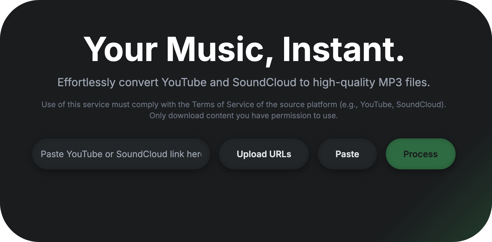

# GoMP3
<div align="center">
  
  <h1><strong>GoMP3</strong></h1>
  <p>Youtube/SoundCloud to MP3 Converter</p>
</div>

## Usage
`go run main.go` will start a webserver at `http://localhost:4444`, where you can paste links or upload a file to extract MP3s from multiple links.

## 🔧 Installation
To get started, install GoMP3 using the following commands:
```bash
git clone https://github.com/CharlesTheGreat77/GoMP3
cd GoMP3
go mod init main
go mod tidy
```

### Note
The library in use for YT/SC to mp3 is slow...